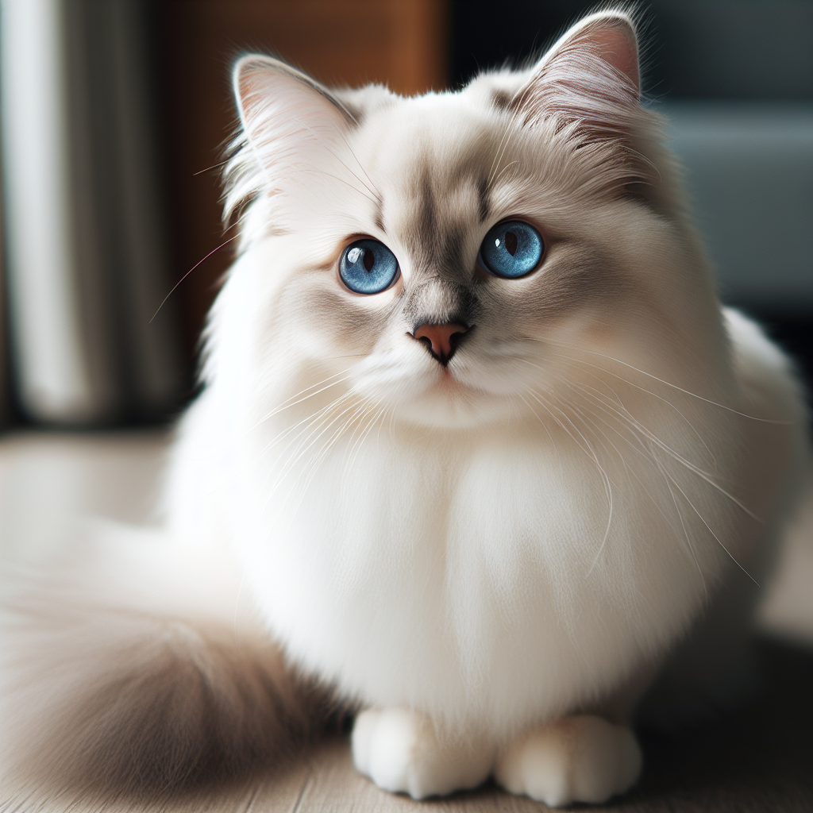

# Experiment with Image Generation - DALL-E

Experiment with [Open AI's Dall-E](https://platform.openai.com/docs/guides/images/introduction) to generate images. A sample response is shown below.

## Acknowledgements

Many thanks ❤️ go to

- [JetBrains](https://www.jetbrains.com/?from=PROJECT-NAME) who provide an [Open Source License](https://www.jetbrains.com/community/opensource/) for this project

## Prerequisites

### OpenAI API Key

Configure your [OpenAI API key](https://platform.openai.com/account/api-keys) in a file named `./.env`:

```shell
OPENAI_API_KEY_NAME=Your API key name
OPENAI_API_KEY=Error: You need to enter your OpenAI API key in the .env file
```

**Attention:** Do not commit your API key to the repository.

### Python Environment and Packages

It is recommended to use a python virtual environment. Create and activate it:

```shell
python3 -m venv venv
source venv/bin/activate
```

Install the required python packages:

```shell
pip install -r requirements.txt
```

Then install this package in development mode:

```shell
pip install --editable .
```

## Run the application

```shell
python src/dall_e/main.py
```

The image will be saved to the file `output.jpg`.

## Sample Image

The following image was generated by [DALL-E 3](https://platform.openai.com/docs/guides/images/introduction) in response to the prompt "A white siamese cat".


